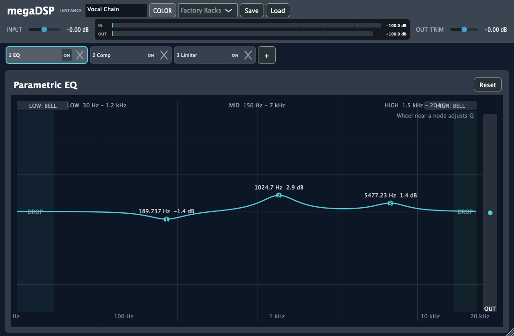
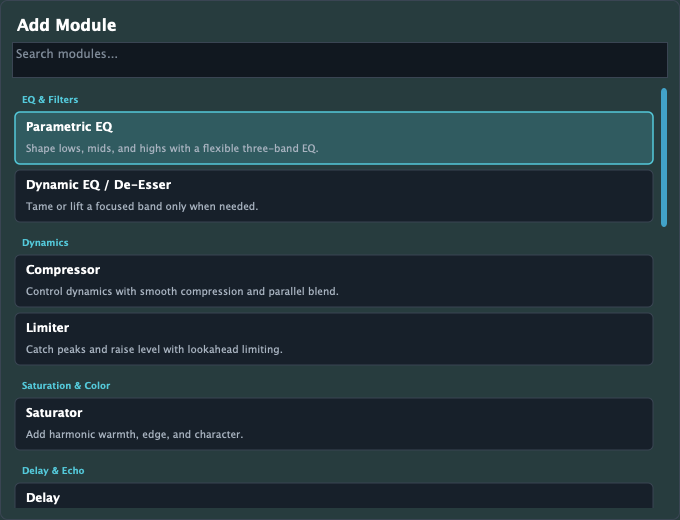
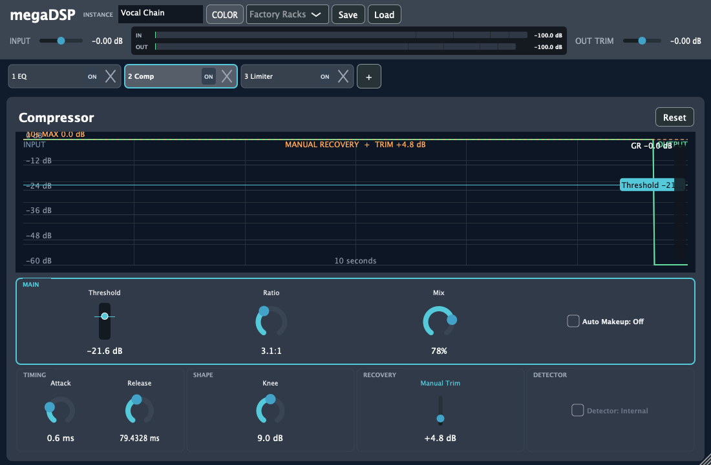
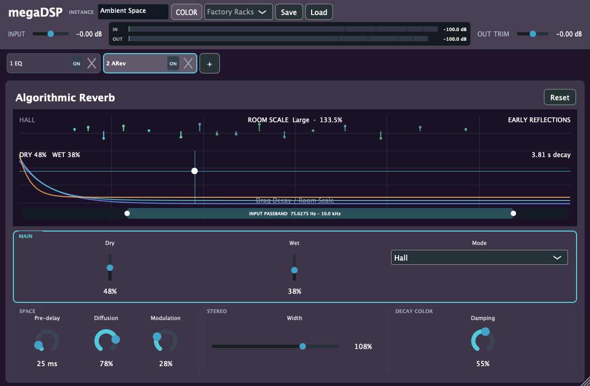

# megaDSP

[](https://github.com/kevinlong206/megaDSP/actions/workflows/build.yml)

An eight-slot modular effects rack with eighteen purpose-built processors,
interactive graphs, realtime analysis, and controls that match the musical
quantity they edit. Available as VST3, AU, and CLAP.



## Supported platforms and formats

| Platform | VST3 | AU | CLAP |
|---|:---:|:---:|:---:|
| macOS 12+ (universal arm64 + x86_64) | ✓ | ✓ | ✓ |
| Windows 10+ (x64) | ✓ | — | ✓ |
| Linux x64 | ✓ | — | ✓ |

## Installation

Download the latest release archive from the [Releases](https://github.com/kevinlong206/megaDSP/releases) page.
Release binaries are **unsigned**; macOS will prompt you to allow them the first time.

<details>
<summary>macOS</summary>

Extract `megaDSP-<version>-macOS-universal.tar.gz` and copy the bundles:

```
megaDSP.vst3      → ~/Library/Audio/Plug-Ins/VST3
megaDSP.component → ~/Library/Audio/Plug-Ins/Components
megaDSP.clap      → ~/Library/Audio/Plug-Ins/CLAP
```

After copying, right-click each bundle in Finder and choose **Open**, or remove the quarantine attribute:

```sh
xattr -r -d com.apple.quarantine ~/Library/Audio/Plug-Ins/VST3/megaDSP.vst3
```

</details>

<details>
<summary>Windows</summary>

Extract `megaDSP-<version>-Windows-x64.zip` and copy the bundles:

```
megaDSP.vst3 → %LOCALAPPDATA%\Programs\Common\VST3
megaDSP.clap → %LOCALAPPDATA%\Programs\Common\CLAP
```

</details>

<details>
<summary>Linux</summary>

Extract `megaDSP-<version>-Linux-x64.tar.gz` and copy the bundles:

```
megaDSP.vst3 → ~/.vst3
megaDSP.clap → ~/.clap
```

</details>

## First-rack workflow

1. Load megaDSP on a track in your DAW.
2. Click the **+** tab to open the module browser. Search by name, category, or tag; use **↑↓** and **Enter** or click a result to add it.
3. Select a tab to see its interactive graph and controls.
4. Drag tabs left or right to reorder the signal chain.
5. **Double-click** a tab (or press **Space / Return / B**) to bypass it — the tab is greyed and labeled **BYPASSED**.
6. Click the **×** icon on a tab to remove it.
7. Use the header **Output Trim** and peak meter to manage the final output level. The meter shows peak hold, near-clip colour zones, and a resettable **CLIP** indicator.



## Effects

### Dynamics

| Module | What it does |
|---|---|
| **Compressor** | Draggable threshold with 10-second input/output history, real-time gain-reduction overlay, primary Auto Makeup, and secondary Manual Trim |
| **Limiter** | Knob-free graph with separate Threshold and Ceiling handles, 10-second level traces, full GR overlay, integrated Release/Lookahead tracks, and Auto Gain |
| **Dynamic EQ / De-Esser** | Single-band stackable processor — drag frequency/range/threshold in the graph, mouse-wheel Q, 10-second gain history, external sidechain with fallback, and Listen |

### EQ & Filtering

| Module | What it does |
|---|---|
| **EQ** | Knob-free response editor with draggable bands, pre/post spectrum traces, latched HP/LP edge lanes, topology pills, proximity-gated mouse-wheel Q, and Output rail |

### Saturation

| Module | What it does |
|---|---|
| **Saturator** | Transfer curve with input/output waveforms; level-compensated auto-gain keeps density and harmonics audible without loudness jumps |

### Time-Based

| Module | What it does |
|---|---|
| **Delay** | Editable tap timeline plus a 2D Rate/Depth Movement field; Sync toggles between free Time and synced Division |
| **Algorithmic Reverb** | 16-line feedback network with Hall, Chamber, and Plate modes; interactive early-reflection field, Decay, Room Scale (Compact → Vast), and independent Dry/Wet |
| **Convolution Reverb** | WAV/AIFF/FLAC IR loading and drag-and-drop, waveform preview, draggable wet Low/High Cut, and independent Dry/Wet rails |
| **Resonant Matrix** | Tuned resonators routed through evolving signed feedback patterns for pitched, metallic spaces |

### Modulation

| Module | What it does |
|---|---|
| **Tremolo** | Amplitude, Harmonic, and Vibrato algorithms; Rate syncs to host divisions; Vibrato shows depth in cents |
| **Vintage Chorus** | Four distinct topologies (Vintage BBD, Dimension, Tri-Chorus, String Ensemble), animated voice-trajectory field, and six-tap Density |
| **Rotary Speaker** | Dual-rotor Doppler model with Brake/Chorale/Tremolo speeds, virtual microphone distance and spread, Cabinet Color, and Drive |

### Glitch & Creative

| Module | What it does |
|---|---|
| **Random Granulizer** | 6-second circular buffer, 16-voice pool, live grain-stream timeline, dual-handle MIN/MAX size window, and pitch-stable grains |
| **Beat Permuter** | Rearranges recent tempo-locked slices into precise repeats, reverses, scatters, and rhythmic glitches |
| **Spectral Prism** | Bends, shifts, smears, and freezes sound around a visual spectral pivot |
| **Wavefold Garden** | Grows animated antialiased harmonics with envelope-responsive wavefolding |

### Stereo

| Module | What it does |
|---|---|
| **Stereo Width** | Frequency-dependent M/S scaling, mono-compatible all-pass Dimension field, Mono Below threshold, and dynamic correlation protection |
| **M/S Decoder** | Reconstructs L/R from encoded Mid/Side input; live vectorscope with Mid, Side, Left, and Right orientation |




## Themes and instance identity

Type a clear label such as **Vocal**, **Guitar**, or **Mix Bus** in the
**INSTANCE** field. The name is saved with that plugin instance and preset, but
does not rename anything in the DAW. Empty names display **Untitled**.

The adjacent **COLOR** button opens sixteen named full-background themes.
The original ten themes retain their saved identities, with Ocean Navy,
Emerald, Burgundy, Indigo, Blue Charcoal, and Dark Olive added. Multiple
instances can use distinct names and colors in the same session.

## Documentation

- [Effects reference](docs/effects.md) — detailed per-effect control descriptions
- [Contributing](CONTRIBUTING.md) — prerequisites, build commands, architecture guide, and PR process
- [Releases](https://github.com/kevinlong206/megaDSP/releases) — download pre-built binaries for v0.23.1-beta.1

## License

JUCE is used under its [commercial or AGPLv3 licence](https://juce.com/juce-open-source-licence). See [CONTRIBUTING.md](CONTRIBUTING.md) for details.
